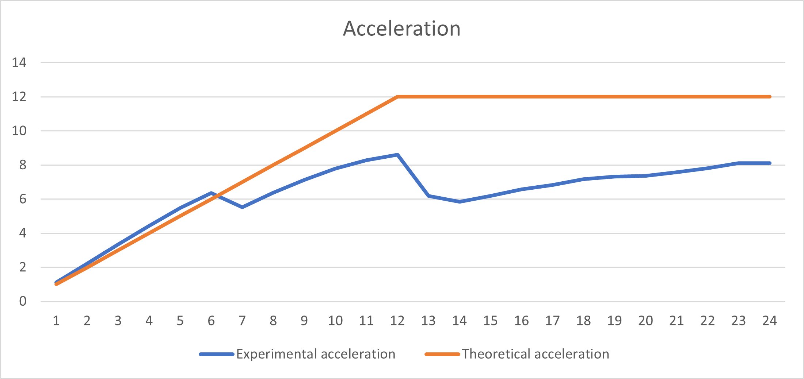

# НИЯУ МИФИ. Лабораторная работа №1. Нестеренко Виталий, Б21-525. 2023

## Используемая система

### Операционная система
Windows 10 LTSC 21H2

### Процессор
Intel Xeon E5-2666v3
```text
Total Cores: 6
Total Threads: 12
Processor Base Frequency: 2.90 GHz
Max Turbo Frequency: 3.50 GHz
L1 cache: 32 KB per core
L2 cache: 256 KB per core
L3 cache: 25 MB
```

### Оперативная память
```text
Memory Type: DDR4
SPD Speed: 2133MHz
Memory Size: 32 GB
```

## Используемый алгоритм

### Принцип работы
Данный алгоритм проходит по массиву чисел и сравнивает их с текущим максимумом для данного потока. Если элемент оказывается больше, то в переменную **max** записывается значение этого элемента. После выполнения итерационной части потока, полученное внутри потока значение **max** сравнивается с **max** из **shared** области, после чего из них выбирается наибольший. Таким образом, наибольший элемент будет в **max** из **shared** области

Алгоритм использует директивы OpenMP, чтобы сделать вычисления параллельными и полностью нагрузить процессор

### Блок схема


### Анализ OpenMP директив
`#pragma omp parallel`

- **Смысл**: Создает параллельный блок кода, который выполняется одновременно на нескольких потоках.
- **Область кода**: Блок кода внутри фигурных скобок после директивы.
- **Роль**: Позволяет одновременно искать максимальный элемент в разных частях массива, ускоряя процесс.
- **Влияние отсутствия**: Без этой директивы код выполнялся бы последовательно, что существенно увеличило бы время
  выполнения.

`#pragma omp for`

- **Смысл**: Распределяет итерации цикла `for` между потоками параллельной секции.
- **Область кода**: Цикл `for` непосредственно после директивы.
- **Роль**: Обеспечивает эффективное распределение работы по поиску максимального элемента между потоками.
- **Влияние отсутствия**: Без этой директивы все потоки выполняли бы одни и те же итерации цикла, что не привело бы к
  ускорению работы.

`reduction(max: max)`

- **Смысл**: Операция редукции для нахождения максимального значения среди всех потоков.
- **Область кода**: Включена в директиву `#pragma omp parallel`.
- **Роль**: Гарантирует, что итоговое значение `max` будет максимальным среди всех элементов, обработанных разными
  потоками.
- **Влияние отсутствия**: Без редукции каждый поток имел бы свою копию переменной `max`, и окончательный результат не
  отражал бы истинный максимум массива.

`default(none)`

- **Смысл**: Указывает, что все переменные должны быть явно заданы в директивах `shared`, `private` и т.д.
- **Область кода**: Включена в директиву `#pragma omp parallel`.
- **Роль**: Повышает безопасность кода, требуя явного определения области видимости переменных.
- **Влияние отсутствия**: Без этой директивы могли бы возникнуть проблемы с видимостью переменных и их случайный захват
  из глобального контекста.

### Оценка сложности
**n** - количество чисел в массиве

**t** - количество потоков

- Сложность последовательного алгоритма - **O(n)**
- Сложность параллельного алгоритма - **O(n/t)**
- Теоретическое ускорение - в **t** раз

## Результаты работы
### Вычисления
- Последовательный алгоритм
  ```text
  OpenMP version: 201511
  Avg time: 0.047353
  ```
- Параллельный алгоритм
  ```text
  OpenMP version: 201511
  Threads: 1      Avg time: 0.042238
  Threads: 2      Avg time: 0.021190
  Threads: 3      Avg time: 0.014186
  Threads: 4      Avg time: 0.010681
  Threads: 5      Avg time: 0.008652
  Threads: 6      Avg time: 0.007455
  Threads: 7      Avg time: 0.008581
  Threads: 8      Avg time: 0.007426
  Threads: 9      Avg time: 0.006652
  Threads: 10     Avg time: 0.006076
  Threads: 11     Avg time: 0.005723
  Threads: 12     Avg time: 0.005509
  Threads: 13     Avg time: 0.007668
  Threads: 14     Avg time: 0.008112
  Threads: 15     Avg time: 0.007651
  Threads: 16     Avg time: 0.007197
  Threads: 17     Avg time: 0.006937
  Threads: 18     Avg time: 0.006600
  Threads: 19     Avg time: 0.006472
  Threads: 20     Avg time: 0.006428
  Threads: 21     Avg time: 0.006248
  Threads: 22     Avg time: 0.006068
  Threads: 23     Avg time: 0.005834
  Threads: 24     Avg time: 0.005843
  ```

### Графики
#### Зависимость времени работы от количества потоков


#### Зависимость ускорения от количества потоков


#### Зависимость эффективности работы программы от количества потоков


## Заключение
В рамках исследования на основе языка программирования C и библиотеки OpenMP было проведено изучение влияния количества потоков на скорость параллельных алгоритмов. Эксперимент включал замеры времени работы параллельной программы для анализа связи между числом потоков и различными аспектами производительности, такими как скорость выполнения, ускорение и общая эффективность.

Было выявлено, что наилучшая эффективность достигается при использовании шести потоков, что соответствует количеству ядер на используемом процессоре. Это показывает, что увеличение числа потоков не всегда приводит к дальнейшему улучшению производительности, так как дополнительные потоки увеличивают сложность управления и могут вызвать накладные расходы.

Также стоит отметить, что все полученные в ходе эксперимента данные могут содержать некоторую степень погрешности. Это следует учитывать при интерпретации результатов.


## Приложение
### Последовательная программа
<details>
  <summary>Исходный код последовательной программы</summary>

  ```c
  #include <stdio.h>
  #include <stdlib.h>
  #include <omp.h>


  int main(int argc, char** argv) {
      const int count = 20000000;
      const int random_seed = 132957;
      const int iterations = 20;
      double start_time, end_time, total = 0;
      int* array;
      int max;

      srand(random_seed);
      printf("OpenMP version: %d\n", _OPENMP);

      for (int j = 0; j < iterations; ++j) {
          max = -1;

          array = (int*)malloc(count*sizeof(int));
          for (int i = 0; i < count; ++i) { 
              array[i] = rand();
          }

          start_time = omp_get_wtime();
          for (int i = 0; i < count; ++i) {
              if (array[i] > max) {
                  max = array[i];
              }
          }
          end_time = omp_get_wtime();
          total += end_time - start_time;

          free(array);
      }

      printf("Avg time: %f\n", total / (double) iterations);
      return 0;
  }
  ```
</details>

### Параллельная программа
<details>
  <summary>Исходный код параллельной программы</summary>

  ```c
  #include <stdio.h>
  #include <stdlib.h>
  #include <omp.h>


  int main(int argc, char** argv) {
      const int count = 20000000;
      const int random_seed = 132957;
      const int max_threads = 24;
      const int iterations = 20;
      double start_time, end_time, total;
      int* array;
      int max;

      srand(random_seed);
      printf("OpenMP version: %d\n", _OPENMP);

      for (int threads = 1; threads <= max_threads; threads++) {
          total = 0;

          for (int j = 0; j < iterations; ++j) {
              max = -1;

              array = (int*)malloc(count*sizeof(int));
              for (int i = 0; i < count; ++i) { 
                  array[i] = rand();
              }

              start_time = omp_get_wtime();
              #pragma omp parallel num_threads(threads) shared(array, count) reduction(max: max) default(none)
              {
                  #pragma omp for
                  for (int i = 0; i < count; ++i) {
                      if (array[i] > max) {
                          max = array[i];
                      }
                  }
              }
              end_time = omp_get_wtime();
              total += end_time - start_time;

              free(array);
          }
          printf("Threads: %d\tAvg time: %f\n", threads, total / (double) iterations);
      }

      return 0;
  }
  ```

</details>
