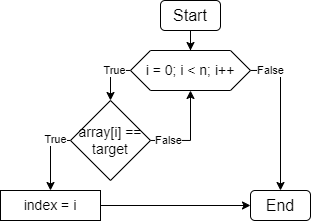
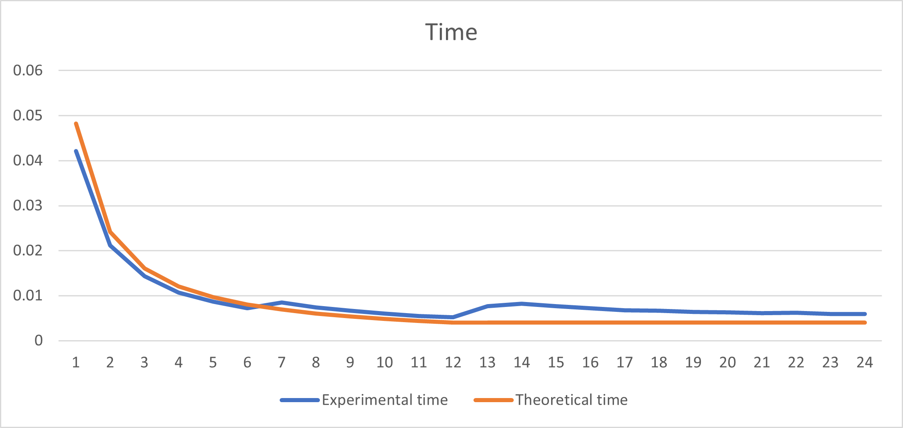
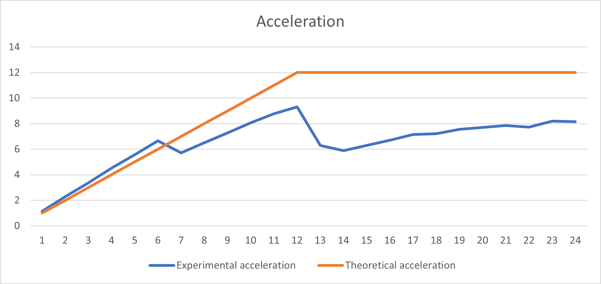
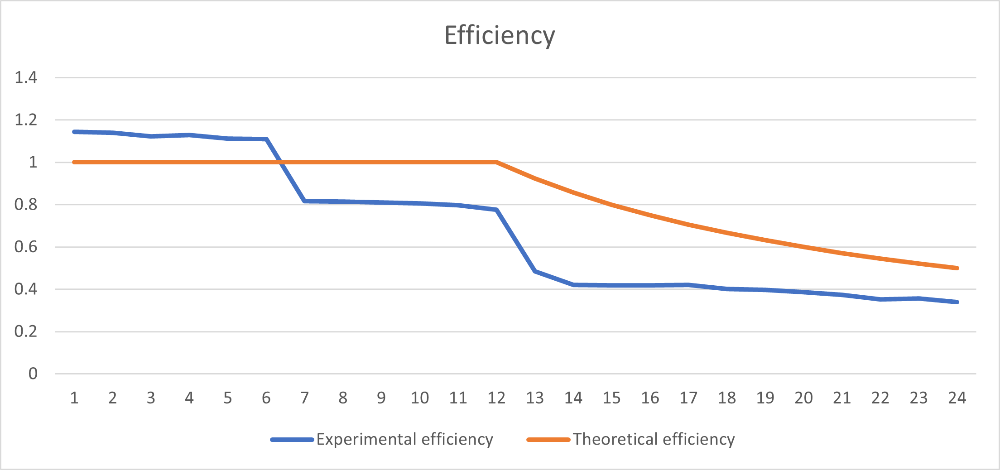

# НИЯУ МИФИ. Лабораторная работа №1. Нестеренко Виталий, Б21-525. 2023

## Используемая система

### Операционная система
Windows 10 LTSC 21H2

### Процессор
Intel Xeon E5-2666v3
```text
Total Cores: 6
Total Threads: 12
Processor Base Frequency: 2.90 GHz
Max Turbo Frequency: 3.50 GHz
L1 cache: 32 KB per core
L2 cache: 256 KB per core
L3 cache: 25 MB
```

### Оперативная память
```text
Memory Type: DDR4
SPD Speed: 2133MHz
Memory Size: 32 GB
```

## Используемый алгоритм

### Принцип работы
Данный алгоритм проходит по массиву чисел и сравнивает их с заданным числом. Если элемент оказывается равен, то в переменную **index** записывается значение этого элемента. После этого алгоритм выходит из цикла поиска числа и выводит индекс заданного числа.

Алгоритм использует директивы OpenMP, чтобы сделать вычисления параллельными и полностью нагрузить процессор

### Блок схема


### Анализ OpenMP директив

`#pragma omp parallel for`
- **Цель**: Создание параллельной области для разделения работы цикла между несколькими потоками.
- **Обоснование**: Используется для параллельного поиска элемента в массиве. Потоки выполняют поиск в разных частях
  массива одновременно.

`omp_get_wtime()`
- **Цель**: Получение текущего времени (в секундах) для измерения времени выполнения.
- **Обоснование**: Измеряет время выполнения поиска в массиве для различного количества потоков.

### Оценка сложности
**n** - количество чисел в массиве

**t** - количество потоков

- Сложность последовательного алгоритма:
  - В лучшем случае: $O(1)$
  - В худшем случае: $O(n)$
  - В среднем: $O(\frac{n}{2})$

- Сложность параллельного алгоритма в среднем случае: $O(\frac{n}{2t})$
- Теоретическое ускорение: $t$ раз

## Результаты работы
### Вычисления
- Последовательный алгоритм
  ```text
  OpenMP version: 201511
  Avg time: 0.048274
  ```
- Параллельный алгоритм
  ```text
  OpenMP version: 201511
  Threads: 1      Avg time: 0.042161
  Threads: 2      Avg time: 0.021172
  Threads: 3      Avg time: 0.014336
  Threads: 4      Avg time: 0.010696
  Threads: 5      Avg time: 0.008681
  Threads: 6      Avg time: 0.007248
  Threads: 7      Avg time: 0.008455
  Threads: 8      Avg time: 0.007413
  Threads: 9      Avg time: 0.006627
  Threads: 10     Avg time: 0.005983
  Threads: 11     Avg time: 0.005505
  Threads: 12     Avg time: 0.005186
  Threads: 13     Avg time: 0.007660
  Threads: 14     Avg time: 0.008197
  Threads: 15     Avg time: 0.007673
  Threads: 16     Avg time: 0.007212
  Threads: 17     Avg time: 0.006762
  Threads: 18     Avg time: 0.006692
  Threads: 19     Avg time: 0.006387
  Threads: 20     Avg time: 0.006264
  Threads: 21     Avg time: 0.006144
  Threads: 22     Avg time: 0.006240
  Threads: 23     Avg time: 0.005888
  Threads: 24     Avg time: 0.005918
  ```

### Графики
#### Зависимость времени работы от количества потоков


#### Зависимость ускорения от количества потоков


#### Зависимость эффективности работы программы от количества потоков


## Заключение
В этом исследовании оценивались характеристики многопоточной программы. Полученные экспериментальные результаты по времени работы программы соответствуют теоретическим расчетам с учетом возможной погрешности. В оптимальной ситуации поиск элемента завершается на первой итерации, и алгоритм тут же прекращает работу. В среднем случае, необходимо примерно $\frac{n}{2t}$ операций для поиска, где t – количество потоков. При наихудшем раскладе, алгоритм перебирает весь массив, что требует $\frac{n}{t}$ операций. Это исследование отличается от первого лабораторного тем, что здесь нет необходимости проверять каждый элемент. Чтобы завершить работу потоков раньше, можно переместить итератор в конец и установить общий флаг, сигнализирующий о возможности завершения потока/цикла. В зависимости от специфики массива, алгоритм может работать как в наихудшем, так и в наилучшем сценарии, аналогично первой лабораторной работе, но с возможностью быстрого завершения.

Также стоит отметить, что все полученные в ходе эксперимента данные могут содержать некоторую степень погрешности. Это следует учитывать при интерпретации результатов.

## Приложение
### Последовательная программа
<details>
  <summary>Исходный код последовательной программы</summary>

  ```c
  #include <stdio.h>
  #include <stdlib.h>
  #include <omp.h>


  int main(int argc, char** argv) {
      const int count = 20000000;
      const int random_seed = 132957;
      const int iterations = 20;
      const int target = 16;
      double start_time, end_time, total = 0;
      int* array;
      int index;

      srand(random_seed);
      printf("OpenMP version: %d\n", _OPENMP);

      for (int j = 0; j < iterations; ++j) {
          index = -1;

          array = (int*)malloc(count*sizeof(int));
          for (int i = 0; i < count; ++i) { 
              array[i] = rand();
          }

          start_time = omp_get_wtime();
          for (int i = 0; i < count; ++i) {
              if (array[i] == target) {
                  index = array[i];
                  break;
              }
          }
          end_time = omp_get_wtime();
          total += end_time - start_time;

          free(array);
      }

      printf("Avg time: %f\n", total / (double) iterations);
      return 0;
  }
  ```
</details>

### Параллельная программа
<details>
  <summary>Исходный код параллельной программы</summary>

  ```c
  #include <stdio.h>
  #include <stdlib.h>
  #include <omp.h>


  int main(int argc, char** argv) {
      const int count = 20000000;
      const int random_seed = 132957;
      const int max_threads = 24;
      const int iterations = 20;
      const int target = 16;
      double start_time, end_time, total;
      int* array;
      int index;

      srand(random_seed);
      printf("OpenMP version: %d\n", _OPENMP);

      for (int threads = 1; threads <= max_threads; threads++) {
          total = 0;

          for (int j = 0; j < iterations; ++j) {
              index = -1;

              array = (int*)malloc(count*sizeof(int));
              for (int i = 0; i < count; ++i) { 
                  array[i] = rand();
              }

              start_time = omp_get_wtime();
              #pragma omp parallel num_threads(threads) reduction(min: index)
              {
                  #pragma omp for
                  for (int i = 0; i < count; ++i) {
                      if (array[i] == target) {
                          index = array[i];
                          i = count;
                      }
                  }
              }
              end_time = omp_get_wtime();
              total += end_time - start_time;

              free(array);
          }
          printf("Threads: %d\tAvg time: %f\n", threads, total / (double) iterations);
      }

      return 0;
  }
  ```

</details>
