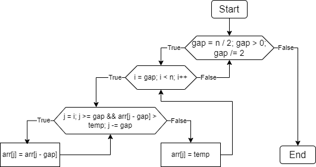
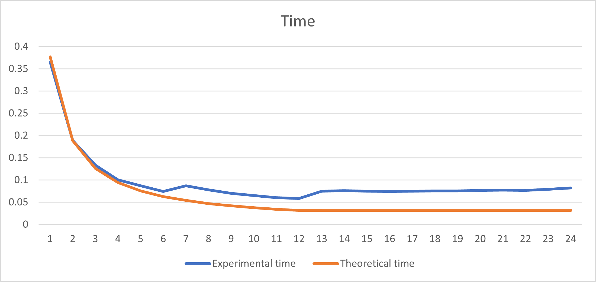
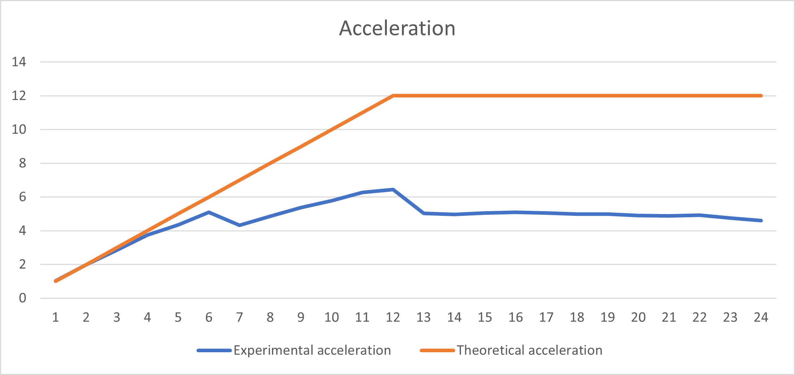
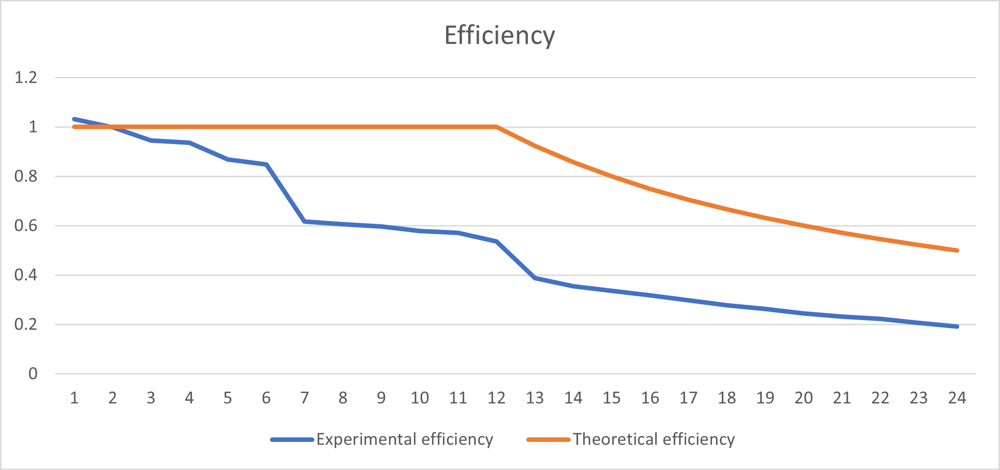

# НИЯУ МИФИ. Лабораторная работа №3. Нестеренко Виталий, Б21-525. 2023

## Используемая система

### Операционная система
Windows 10 LTSC 21H2

### Процессор
Intel Xeon E5-2666v3
```text
Total Cores: 6
Total Threads: 12
Processor Base Frequency: 2.90 GHz
Max Turbo Frequency: 3.50 GHz
L1 cache: 32 KB per core
L2 cache: 256 KB per core
L3 cache: 25 MB
```

### Оперативная память
```text
Memory Type: DDR4
SPD Speed: 2133MHz
Memory Size: 32 GB
```

## Используемый алгоритм

### Принцип работы
Сортировка Шелла — это метод сортировки, который улучшает сортировку вставками за счёт сначала сортировки элементов, находящихся на определённом расстоянии друг от друга. Интервал между элементами постепенно уменьшается, пока не достигает одного, превращаясь в обычную сортировку вставками. Это уменьшает общее количество сравнений и перестановок, делая алгоритм эффективнее для больших массивов.

Алгоритм использует директивы OpenMP, чтобы сделать вычисления параллельными и полностью нагрузить процессор

### Блок схема


### Анализ OpenMP директив

`#pragma omp parallel for`

- **Цель**: Создание параллельной области, где каждый поток выполняет код внутри этой области.
- **Обоснование**: Используется для параллельной сортировки вставками для различных частей массива:
    - `shared(array, m, n)`: Этот параметр указывает, что переменные `array`, `m` и `n` должны быть доступны для чтения
      и записи всеми потоками.
    - `private(i)`: Каждый поток будет иметь свою собственную копию переменной i.
    - `num_threads(threads)`: Определяет количество потоков, которые должны быть использованы для выполнения цикла.

`omp_get_wtime()`

- **Цель**: Получение текущего времени (в секундах) для измерения времени выполнения.
- **Обоснование**: Измеряет время выполнения поиска в массиве для различного количества потоков.

### Оценка сложности
**n** - количество чисел в массиве

**t** - количество потоков

- Сложность последовательного алгоритма:
  - В лучшем случае: $O(n\cdot\log{n})$
  - В худшем случае: $O(n^2)$

## Результаты работы
### Вычисления
- Последовательный алгоритм
  ```text
  OpenMP version: 201511
  Avg time: 0.377013
  ```
- Параллельный алгоритм
  ```text
  OpenMP version: 201511
  Threads: 1      Avg time: 0.365283
  Threads: 2      Avg time: 0.188833
  Threads: 3      Avg time: 0.132850
  Threads: 4      Avg time: 0.100581
  Threads: 5      Avg time: 0.086783
  Threads: 6      Avg time: 0.074018
  Threads: 7      Avg time: 0.087244
  Threads: 8      Avg time: 0.077673
  Threads: 9      Avg time: 0.070109
  Threads: 10     Avg time: 0.065166
  Threads: 11     Avg time: 0.060023
  Threads: 12     Avg time: 0.058543
  Threads: 13     Avg time: 0.074892
  Threads: 14     Avg time: 0.075776
  Threads: 15     Avg time: 0.074665
  Threads: 16     Avg time: 0.073943
  Threads: 17     Avg time: 0.074608
  Threads: 18     Avg time: 0.075501
  Threads: 19     Avg time: 0.075558
  Threads: 20     Avg time: 0.076793
  Threads: 21     Avg time: 0.077259
  Threads: 22     Avg time: 0.076654
  Threads: 23     Avg time: 0.079189
  Threads: 24     Avg time: 0.081823
  ```

### Графики
#### Зависимость времени работы от количества потоков


#### Зависимость ускорения от количества потоков


#### Зависимость эффективности работы программы от количества потоков


## Заключение
В этом исследовании изучались характеристики многопоточной реализации алгоритма сортировки Шелла. Экспериментальные данные по времени работы программы соответствуют теоретическим оценкам в рамках допустимой ошибки. В процессе сортировки, каждое последующее сокращение интервала между элементами приводило к делению операций на несколько потоков, где каждый подмассив обрабатывался отдельно. Это ускоряло процесс сортировки: к тому моменту, как первый поток доходил до начала блока, обрабатываемого следующим потоком, этот блок уже был отсортирован. Такой подход приводил к более раннему завершению или даже к отсутствию необходимости в запуске последующих циклов

Также стоит отметить, что все полученные в ходе эксперимента данные могут содержать некоторую степень погрешности. Это следует учитывать при интерпретации результатов.

## Приложение
### Последовательная программа
<details>
  <summary>Исходный код последовательной программы</summary>

  ```c
  #include <stdio.h>
  #include <stdlib.h>
  #include <omp.h>

  void shellSort(int* arr, int n) {
      for (int gap = n / 2; gap > 0; gap /= 2) {
          for (int i = gap; i < n; i++) {
              int temp = arr[i];
              int j;
              for (j = i; j >= gap && arr[j - gap] > temp; j -= gap)
                  arr[j] = arr[j - gap];
              arr[j] = temp;
          }
      }
  }

  int main(int argc, char** argv) {
      const int count = 1000000;
      const int random_seed = 132957;
      const int iterations = 20;
      double start_time, end_time, total = 0;
      int* array;

      srand(random_seed);
      printf("OpenMP version: %d\n", _OPENMP);

      for (int j = 0; j < iterations; ++j) {
          array = (int*)malloc(count*sizeof(int));
          for (int i = 0; i < count; ++i) { 
              array[i] = rand();
          }

          start_time = omp_get_wtime();
          shellSort(array, count);
          end_time = omp_get_wtime();
          total += end_time - start_time;

          free(array);
      }

      printf("Avg time: %f\n", total / (double) iterations);
      return 0;
  }
  ```
</details>

### Параллельная программа
<details>
  <summary>Исходный код параллельной программы</summary>

  ```c
  #include <stdio.h>
  #include <stdlib.h>
  #include <omp.h>

  void shellSort(int* arr, int n, int threads) {
      int i, gap;
      for (gap = n / 2; gap > 0; gap /= 2) {
          #pragma omp parallel for shared(arr, gap, n) private(i) num_threads(threads)
          for (i = gap; i < n; i++) {
              int temp = arr[i];
              int j;
              for (j = i; j >= gap && arr[j - gap] > temp; j -= gap)
                  arr[j] = arr[j - gap];
              arr[j] = temp;
          }
      }
  }

  int main(int argc, char** argv) {
      const int count = 1000000;
      const int random_seed = 132957;
      const int max_threads = 24;
      const int iterations = 20;
      double start_time, end_time, total;
      int* array;

      srand(random_seed);
      printf("OpenMP version: %d\n", _OPENMP);

      for (int threads = 1; threads <= max_threads; threads++) {
          total = 0;

          for (int j = 0; j < iterations; ++j) {
              array = (int*)malloc(count*sizeof(int));
              for (int i = 0; i < count; ++i) { 
                  array[i] = rand();
              }

              start_time = omp_get_wtime();
              shellSort(array, count, threads);
              end_time = omp_get_wtime();
              total += end_time - start_time;

              free(array);
          }
          printf("Threads: %d\tAvg time: %f\n", threads, total / (double) iterations);
      }

      return 0;
  }
  ```

</details>
