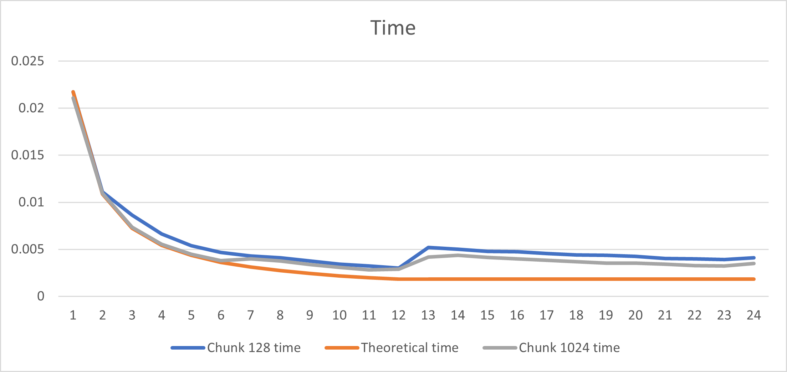
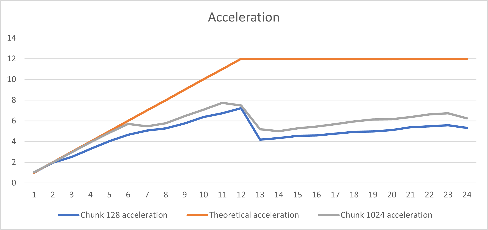
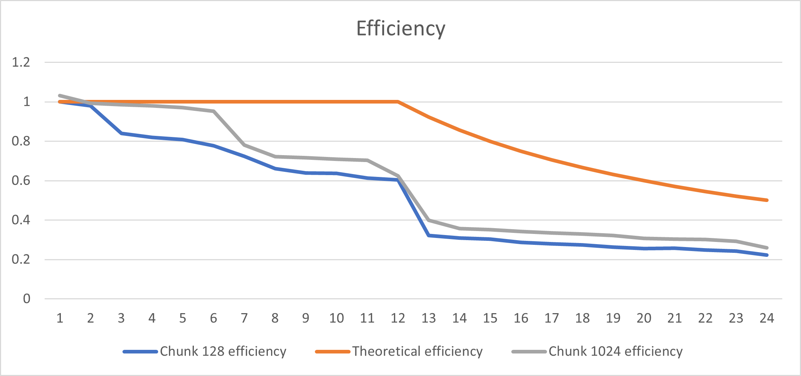
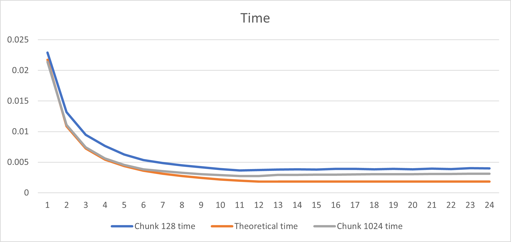
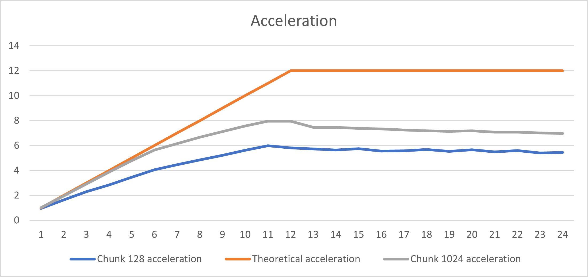
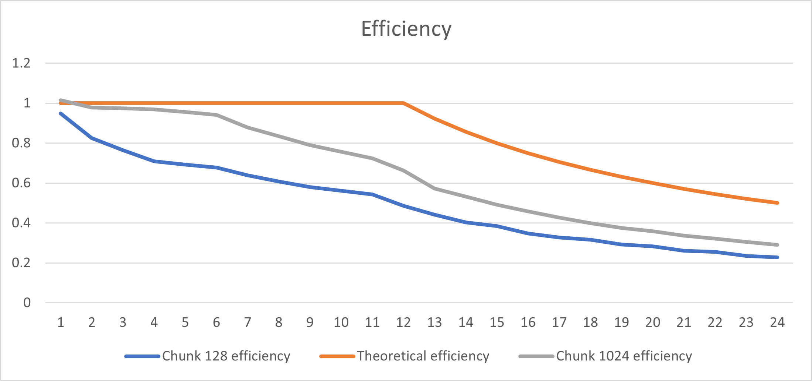
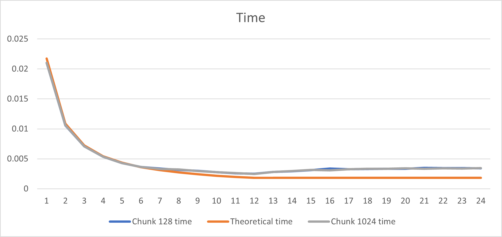
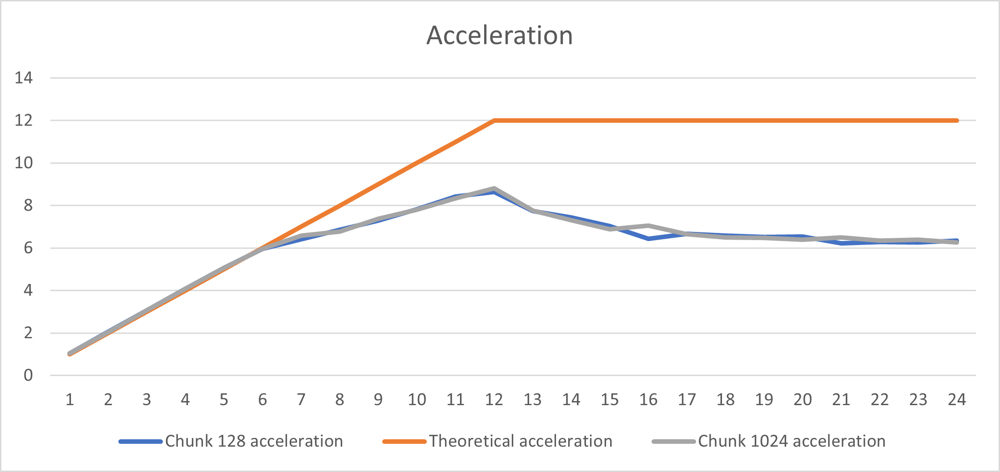
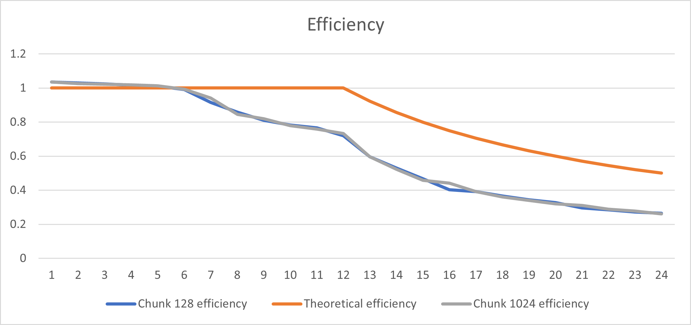

# НИЯУ МИФИ. Лабораторная работа №4. Нестеренко Виталий, Б21-525. 2023

## Используемая система

### Операционная система
Windows 10 LTSC 21H2

### Процессор
Intel Xeon E5-2666v3
```text
Total Cores: 6
Total Threads: 12
Processor Base Frequency: 2.90 GHz
Max Turbo Frequency: 3.50 GHz
L1 cache: 32 KB per core
L2 cache: 256 KB per core
L3 cache: 25 MB
```

### Оперативная память
```text
Memory Type: DDR4
SPD Speed: 2133MHz
Memory Size: 32 GB
```

## Используемый алгоритм
### Пример вычислительного алгоритма, использующего механизм явных блокировок
Алгоритм выполняет параллельное сложение элементов массива.

Блокировка гарантирует, что вся операция сложения sum += array[i] будет выполнена атомарно. Без блокировки, возможна ситуация, когда один поток начинает операцию обновления, но до её завершения другой поток начинает своё обновление, в результате чего часть данных теряется или искажается. Благодаря блокировке, итоговое значение sum будет отражать полную сумму всех элементов массива array, поскольку каждое обновление будет выполнено полностью и последовательно.

Алгоритм использует директивы OpenMP, чтобы сделать вычисления параллельными и полностью нагрузить процессор


## Анализ OpenMP директив

### Анализ окружения

- `_OPENMP`: Эта константа определяет версию OpenMP.
- `omp_get_num_procs()`: Возвращает количество процессоров доступных для программы.
- `omp_get_max_threads()`: Возвращает максимально возможное количество потоков.
- `omp_get_dynamic()`: Показывает, включена ли динамическая регулировка числа потоков.
- `omp_get_wtick()`: Возвращает точность таймера.
- `omp_get_nested()`: Показывает, включена ли вложенная параллельность.
- `omp_get_max_active_levels()`: Возвращает максимальное количество активных уровней параллельности.
- `omp_get_schedule()`: Возвращает текущую политику планирования и размер чанка.

### Алгоритм, использующий механизм явных блокировок

- `omp_lock_t`: Тип данных для блокировок.
- `omp_init_lock()`: Инициализирует блокировку.
- `#pragma omp parallel for`: Директива для выполнения цикла for в параллельном режиме.
- `omp_set_lock(), omp_unset_lock()`: Устанавливает и снимает блокировку соответственно.
- `omp_destroy_lock()`: Уничтожает объект блокировки.

### Программа для исследования режимов распределения 

- `omp_get_wtime()`: Возвращает текущее время (используется для измерения времени выполнения).
- `#pragma omp parallel num_threads(threads)`: Запускает параллельный блок с указанным количеством потоков.
- `shared`: Ключевое слово, определяющее общие переменные для всех потоков.
- `reduction(max`: max)`: Директива для выполнения операции редукции (в данном случае, поиска максимального значения).
- `default(none)`: Указывает, что каждая переменная должна быть явно определена.
- `#pragma omp for schedule(static | dynamic | guided, chunk)`:
    - `static`: Распределение итераций выполняется заранее в равных частях между потоками. Если размер чанка не указан, итерации
      делятся поровну. Если размер чанка указан, каждый поток выполняет группы итераций фиксированного размера.
    - `dynamic`: В этом режиме потоки запрашивают новый чанк итераций после завершения предыдущего. Это полезно, когда время
      выполнения итераций значительно варьируется, так как помогает балансировать нагрузку между потоками. Размер чанка
      может быть указан, чтобы контролировать количество итераций, обрабатываемых за один раз.
    - `guided`: Похоже на динамическое распределение, но размер чанка уменьшается со временем, оптимизируя баланс между
      управлением нагрузкой и накладными расходами на синхронизацию.

## Результаты работы
### Вычисления
- Анализ окружения
  ```text
  OpenMP Version 201511
  Number of processors: 12
  Maximum number of threads: 12
  Dynamic threads are disabled
  Timer resolution: 1e-09 seconds
  Nested parallelism is disabled
  Max active levels: 1
  Schedule: 2, chunk size: 1
  ```
- Тип schedule: static
  <details>
    <summary>Размер фрагмента 128</summary>

    ```text
    OpenMP version: 201511
    Threads: 1      Avg time: 0.021734
    Threads: 2      Avg time: 0.011084
    Threads: 3      Avg time: 0.008625
    Threads: 4      Avg time: 0.006623
    Threads: 5      Avg time: 0.005377
    Threads: 6      Avg time: 0.004664
    Threads: 7      Avg time: 0.004296
    Threads: 8      Avg time: 0.004115
    Threads: 9      Avg time: 0.003775
    Threads: 10     Avg time: 0.003413
    Threads: 11     Avg time: 0.003225
    Threads: 12     Avg time: 0.003004
    Threads: 13     Avg time: 0.005189
    Threads: 14     Avg time: 0.005013
    Threads: 15     Avg time: 0.004788
    Threads: 16     Avg time: 0.004733
    Threads: 17     Avg time: 0.004568
    Threads: 18     Avg time: 0.004402
    Threads: 19     Avg time: 0.004367
    Threads: 20     Avg time: 0.004254
    Threads: 21     Avg time: 0.004037
    Threads: 22     Avg time: 0.003973
    Threads: 23     Avg time: 0.003902
    Threads: 24     Avg time: 0.004088
    ```
  </details>

  <details>
    <summary>Размер фрагмента 1024</summary>

    ```text
    OpenMP version: 201511
    Threads: 1      Avg time: 0.021072
    Threads: 2      Avg time: 0.010942
    Threads: 3      Avg time: 0.007349
    Threads: 4      Avg time: 0.005548
    Threads: 5      Avg time: 0.004474
    Threads: 6      Avg time: 0.003807
    Threads: 7      Avg time: 0.003974
    Threads: 8      Avg time: 0.003767
    Threads: 9      Avg time: 0.003372
    Threads: 10     Avg time: 0.003068
    Threads: 11     Avg time: 0.002808
    Threads: 12     Avg time: 0.002905
    Threads: 13     Avg time: 0.004185
    Threads: 14     Avg time: 0.004344
    Threads: 15     Avg time: 0.004124
    Threads: 16     Avg time: 0.003982
    Threads: 17     Avg time: 0.003822
    Threads: 18     Avg time: 0.003665
    Threads: 19     Avg time: 0.003548
    Threads: 20     Avg time: 0.003531
    Threads: 21     Avg time: 0.003408
    Threads: 22     Avg time: 0.003281
    Threads: 23     Avg time: 0.003229
    Threads: 24     Avg time: 0.003484
    ```
  </details>

- Тип schedule: dynamic
  <details>
    <summary>Размер фрагмента 128</summary>

    ```text
    OpenMP version: 201511
    Threads: 1      Avg time: 0.022897
    Threads: 2      Avg time: 0.013183
    Threads: 3      Avg time: 0.009485
    Threads: 4      Avg time: 0.007663
    Threads: 5      Avg time: 0.006272
    Threads: 6      Avg time: 0.005349
    Threads: 7      Avg time: 0.004859
    Threads: 8      Avg time: 0.004474
    Threads: 9      Avg time: 0.004170
    Threads: 10     Avg time: 0.003874
    Threads: 11     Avg time: 0.003634
    Threads: 12     Avg time: 0.003733
    Threads: 13     Avg time: 0.003789
    Threads: 14     Avg time: 0.003848
    Threads: 15     Avg time: 0.003776
    Threads: 16     Avg time: 0.003906
    Threads: 17     Avg time: 0.003905
    Threads: 18     Avg time: 0.003818
    Threads: 19     Avg time: 0.003924
    Threads: 20     Avg time: 0.003832
    Threads: 21     Avg time: 0.003962
    Threads: 22     Avg time: 0.003878
    Threads: 23     Avg time: 0.004020
    Threads: 24     Avg time: 0.003986
    ```
  </details>

  <details>
    <summary>Размер фрагмента 1024</summary>

    ```text
    OpenMP version: 201511
    Threads: 1      Avg time: 0.021405
    Threads: 2      Avg time: 0.011101
    Threads: 3      Avg time: 0.007436
    Threads: 4      Avg time: 0.005610
    Threads: 5      Avg time: 0.004548
    Threads: 6      Avg time: 0.003847
    Threads: 7      Avg time: 0.003531
    Threads: 8      Avg time: 0.003258
    Threads: 9      Avg time: 0.003055
    Threads: 10     Avg time: 0.002872
    Threads: 11     Avg time: 0.002731
    Threads: 12     Avg time: 0.002735
    Threads: 13     Avg time: 0.002917
    Threads: 14     Avg time: 0.002914
    Threads: 15     Avg time: 0.002945
    Threads: 16     Avg time: 0.002967
    Threads: 17     Avg time: 0.002998
    Threads: 18     Avg time: 0.003026
    Threads: 19     Avg time: 0.003044
    Threads: 20     Avg time: 0.003023
    Threads: 21     Avg time: 0.003070
    Threads: 22     Avg time: 0.003069
    Threads: 23     Avg time: 0.003098
    Threads: 24     Avg time: 0.003123
    ```
  </details>

- Тип schedule: guided
  <details>
    <summary>Размер фрагмента 128</summary>

    ```text
    OpenMP version: 201511
    Threads: 1      Avg time: 0.021007
    Threads: 2      Avg time: 0.010555
    Threads: 3      Avg time: 0.007072
    Threads: 4      Avg time: 0.005343
    Threads: 5      Avg time: 0.004296
    Threads: 6      Avg time: 0.003652
    Threads: 7      Avg time: 0.003393
    Threads: 8      Avg time: 0.003166
    Threads: 9      Avg time: 0.002983
    Threads: 10     Avg time: 0.002775
    Threads: 11     Avg time: 0.002581
    Threads: 12     Avg time: 0.002516
    Threads: 13     Avg time: 0.002806
    Threads: 14     Avg time: 0.002924
    Threads: 15     Avg time: 0.003095
    Threads: 16     Avg time: 0.003375
    Threads: 17     Avg time: 0.003258
    Threads: 18     Avg time: 0.003298
    Threads: 19     Avg time: 0.003334
    Threads: 20     Avg time: 0.003329
    Threads: 21     Avg time: 0.003498
    Threads: 22     Avg time: 0.003465
    Threads: 23     Avg time: 0.003466
    Threads: 24     Avg time: 0.003426
    ```
  </details>

  <details>
    <summary>Размер фрагмента 1024</summary>

    ```text
    OpenMP version: 201511
    Threads: 1      Avg time: 0.020997
    Threads: 2      Avg time: 0.010593
    Threads: 3      Avg time: 0.007084
    Threads: 4      Avg time: 0.005338
    Threads: 5      Avg time: 0.004293
    Threads: 6      Avg time: 0.003651
    Threads: 7      Avg time: 0.003299
    Threads: 8      Avg time: 0.003211
    Threads: 9      Avg time: 0.002946
    Threads: 10     Avg time: 0.002787
    Threads: 11     Avg time: 0.002607
    Threads: 12     Avg time: 0.002469
    Threads: 13     Avg time: 0.002804
    Threads: 14     Avg time: 0.002970
    Threads: 15     Avg time: 0.003163
    Threads: 16     Avg time: 0.003079
    Threads: 17     Avg time: 0.003271
    Threads: 18     Avg time: 0.003343
    Threads: 19     Avg time: 0.003359
    Threads: 20     Avg time: 0.003404
    Threads: 21     Avg time: 0.003340
    Threads: 22     Avg time: 0.003423
    Threads: 23     Avg time: 0.003397
    Threads: 24     Avg time: 0.003470
    ```
  </details>


## Графики
### Тип schedule: static
#### Зависимость времени работы от количества потоков


#### Зависимость ускорения от количества потоков


#### Зависимость эффективности работы программы от количества потоков


### Тип schedule: dynamic
#### Зависимость времени работы от количества потоков


#### Зависимость ускорения от количества потоков


#### Зависимость эффективности работы программы от количества потоков


### Тип schedule: guided
#### Зависимость времени работы от количества потоков


#### Зависимость ускорения от количества потоков


#### Зависимость эффективности работы программы от количества потоков


## Заключение
В рамках проведенного исследования, в котором применялись различные типы разделения нагрузки, было выявлено следующее:

- Тип разделения: dynamic и static

  Кривые имеют схожие формы, однако при большем количестве фрагмента, алгоритм отрабатывает быстрее

- Тип разделения: guided

  Этот тип показывает лучшие результаты при любых размерах фрагментов и при любом количестве потоков. Время работы алгоритма при разных размерах фрагмента отличается в пределах погрешности

## Приложение
### Последовательная программа
<details>
  <summary>Исходный код последовательной программы</summary>

  ```c
  #include <stdio.h>
  #include <stdlib.h>
  #include <omp.h>


  int main(int argc, char** argv) {
      const int count = 20000000;
      const int random_seed = 132957;
      const int iterations = 20;
      double start_time, end_time, total = 0;
      int* array;
      int max;

      srand(random_seed);
      printf("OpenMP version: %d\n", _OPENMP);

      for (int j = 0; j < iterations; ++j) {
          max = -1;

          array = (int*)malloc(count*sizeof(int));
          for (int i = 0; i < count; ++i) { 
              array[i] = rand();
          }

          start_time = omp_get_wtime();
          for (int i = 0; i < count; ++i) {
              if (array[i] > max) {
                  max = array[i];
              }
          }
          end_time = omp_get_wtime();
          total += end_time - start_time;

          free(array);
      }

      printf("Avg time: %f\n", total / (double) iterations);
      return 0;
  }
  ```
</details>

### Параллельная программа
<details>
  <summary>Исходный код параллельной программы</summary>

  ```c
  #include <stdio.h>
  #include <stdlib.h>
  #include <omp.h>


  int main(int argc, char** argv) {
      const int count = 20000000;
      const int random_seed = 132957;
      const int max_threads = 24;
      const int iterations = 20;
      double start_time, end_time, total;
      int* array;
      int max;

      srand(random_seed);
      printf("OpenMP version: %d\n", _OPENMP);

      for (int threads = 1; threads <= max_threads; threads++) {
          total = 0;

          for (int j = 0; j < iterations; ++j) {
              max = -1;

              array = (int*)malloc(count*sizeof(int));
              for (int i = 0; i < count; ++i) { 
                  array[i] = rand();
              }

              start_time = omp_get_wtime();
              #pragma omp parallel num_threads(threads) shared(array, count) reduction(max: max) default(none)
              {
                  #pragma omp for
                  for (int i = 0; i < count; ++i) {
                      if (array[i] > max) {
                          max = array[i];
                      }
                  }
              }
              end_time = omp_get_wtime();
              total += end_time - start_time;

              free(array);
          }
          printf("Threads: %d\tAvg time: %f\n", threads, total / (double) iterations);
      }

      return 0;
  }
  ```

</details>
