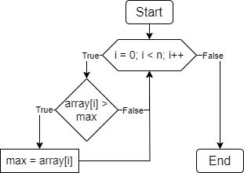
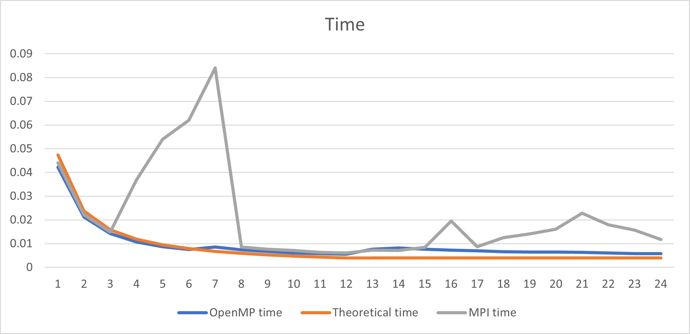
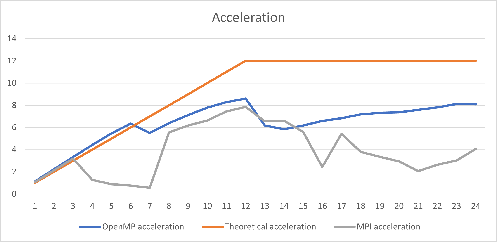
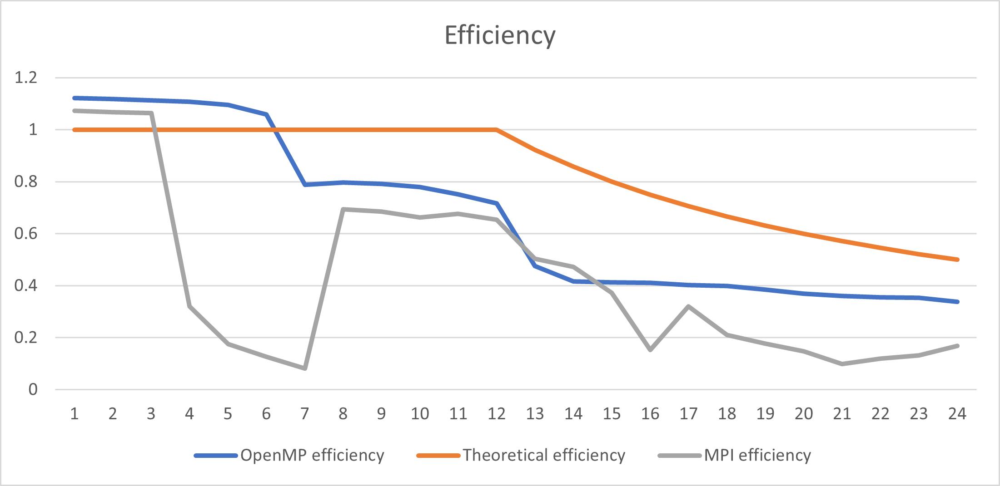

# НИЯУ МИФИ. Лабораторная работа №5. Нестеренко Виталий, Б21-525. 2023

## Используемая система

### Операционная система
Windows 10 LTSC 21H2

### Процессор
Intel Xeon E5-2666v3
```text
Total Cores: 6
Total Threads: 12
Processor Base Frequency: 2.90 GHz
Max Turbo Frequency: 3.50 GHz
L1 cache: 32 KB per core
L2 cache: 256 KB per core
L3 cache: 25 MB
```

### Оперативная память
```text
Memory Type: DDR4
SPD Speed: 2133MHz
Memory Size: 32 GB
```

## Используемый алгоритм

### Принцип работы
Был реализован параллельный алгоритм поиска максимума в массиве с помощью технологии MPI. Алгоритм с помощью технологии MPI заключается в том, что массив длины N разбивается на равные промежутки по количеству процессов. В каждой подпоследовательности находится локальный максимум и с помощью функции MPI_Reduce(&local_max, &max, 1, MPI_INTEGER, MPI_MAX, 0, MPI_COMM_WORLD) выбирается главный максимум.

### Блок схема


### Оценка сложности
**n** - количество чисел в массиве

**t** - количество потоков

- Сложность последовательного алгоритма - **O(n)**
- Сложность параллельного алгоритма - **O(n/t)**
- Теоретическое ускорение - в **t** раз

## Результаты работы
### Вычисления
- Последовательный алгоритм
  ```text
  OpenMP version: 201511
  Avg time: 0.047353
  ```
- Параллельный алгоритм OpenMP
  ```text
  OpenMP version: 201511
  Threads: 1      Avg time: 0.042238
  Threads: 2      Avg time: 0.021190
  Threads: 3      Avg time: 0.014186
  Threads: 4      Avg time: 0.010681
  Threads: 5      Avg time: 0.008652
  Threads: 6      Avg time: 0.007455
  Threads: 7      Avg time: 0.008581
  Threads: 8      Avg time: 0.007426
  Threads: 9      Avg time: 0.006652
  Threads: 10     Avg time: 0.006076
  Threads: 11     Avg time: 0.005723
  Threads: 12     Avg time: 0.005509
  Threads: 13     Avg time: 0.007668
  Threads: 14     Avg time: 0.008112
  Threads: 15     Avg time: 0.007651
  Threads: 16     Avg time: 0.007197
  Threads: 17     Avg time: 0.006937
  Threads: 18     Avg time: 0.006600
  Threads: 19     Avg time: 0.006472
  Threads: 20     Avg time: 0.006428
  Threads: 21     Avg time: 0.006248
  Threads: 22     Avg time: 0.006068
  Threads: 23     Avg time: 0.005834
  Threads: 24     Avg time: 0.005843
  ```

- Параллельный алгоритм OpenMP
  ```text
  Threads: 1      Avg time: 0.044116
  Threads: 2      Avg time: 0.022177
  Threads: 3      Avg time: 0.014829
  Threads: 4      Avg time: 0.036976
  Threads: 5      Avg time: 0.054006
  Threads: 6      Avg time: 0.062014
  Threads: 7      Avg time: 0.084036
  Threads: 8      Avg time: 0.008538
  Threads: 9      Avg time: 0.007672
  Threads: 10     Avg time: 0.007152
  Threads: 11     Avg time: 0.006359
  Threads: 12     Avg time: 0.006032
  Threads: 13     Avg time: 0.007233
  Threads: 14     Avg time: 0.007166
  Threads: 15     Avg time: 0.008472
  Threads: 16     Avg time: 0.019467
  Threads: 17     Avg time: 0.008712
  Threads: 18     Avg time: 0.012471
  Threads: 19     Avg time: 0.014117
  Threads: 20     Avg time: 0.016100
  Threads: 21     Avg time: 0.022839
  Threads: 22     Avg time: 0.017968
  Threads: 23     Avg time: 0.015616
  Threads: 24     Avg time: 0.011666
  ```

### Графики
#### Зависимость времени работы от количества потоков


#### Зависимость ускорения от количества потоков


#### Зависимость эффективности работы программы от количества потоков


## Заключение
В данной работе проводились измерения характеристик распараллеленной программы. Результаты говорят, что OpenMP работает намного эффективнее, чем MPI. Но эти технологии используются в разных случаях, поэтому MPI будет лучше для работы с несколькими кластерами, а OpenMP для работы в пределах одного компьютера

## Приложение
### Последовательная программа
<details>
  <summary>Исходный код последовательной программы</summary>

  ```c
  #include <stdio.h>
  #include <stdlib.h>
  #include <omp.h>


  int main(int argc, char** argv) {
      const int count = 20000000;
      const int random_seed = 132957;
      const int iterations = 20;
      double start_time, end_time, total = 0;
      int* array;
      int max;

      srand(random_seed);
      printf("OpenMP version: %d\n", _OPENMP);

      for (int j = 0; j < iterations; ++j) {
          max = -1;

          array = (int*)malloc(count*sizeof(int));
          for (int i = 0; i < count; ++i) { 
              array[i] = rand();
          }

          start_time = omp_get_wtime();
          for (int i = 0; i < count; ++i) {
              if (array[i] > max) {
                  max = array[i];
              }
          }
          end_time = omp_get_wtime();
          total += end_time - start_time;

          free(array);
      }

      printf("Avg time: %f\n", total / (double) iterations);
      return 0;
  }
  ```
</details>

### Параллельная программа OpenMP
<details>
  <summary>Исходный код параллельной программы</summary>

  ```c
  #include <stdio.h>
  #include <stdlib.h>
  #include <omp.h>


  int main(int argc, char** argv) {
      const int count = 20000000;
      const int random_seed = 132957;
      const int max_threads = 24;
      const int iterations = 20;
      double start_time, end_time, total;
      int* array;
      int max;

      srand(random_seed);
      printf("OpenMP version: %d\n", _OPENMP);

      for (int threads = 1; threads <= max_threads; threads++) {
          total = 0;

          for (int j = 0; j < iterations; ++j) {
              max = -1;

              array = (int*)malloc(count*sizeof(int));
              for (int i = 0; i < count; ++i) { 
                  array[i] = rand();
              }

              start_time = omp_get_wtime();
              #pragma omp parallel num_threads(threads) shared(array, count) reduction(max: max) default(none)
              {
                  #pragma omp for
                  for (int i = 0; i < count; ++i) {
                      if (array[i] > max) {
                          max = array[i];
                      }
                  }
              }
              end_time = omp_get_wtime();
              total += end_time - start_time;

              free(array);
          }
          printf("Threads: %d\tAvg time: %f\n", threads, total / (double) iterations);
      }

      return 0;
  }
  ```

</details>

### Параллельная программа MPI
<details>
  <summary>Исходный код параллельной программы</summary>

  ```c
  #include <stdio.h>
  #include <stdlib.h>
  #include <mpi.h>


  int main(int argc, char** argv) {
      const int count = 20000000;
      const int random_seed = 132957;
      const int max_threads = 24;
      const int iterations = 10;
      double start_time, end_time, total;
      int max, rank, size, chunk;
      int* array = (int*)malloc(count*sizeof(int));

      srand(random_seed);
      MPI_Init(&argc, &argv);
      MPI_Comm_rank(MPI_COMM_WORLD, &rank);
      MPI_Comm_size(MPI_COMM_WORLD, &size);
      chunk = count / size;

      for (int j = 0; j < iterations; ++j) {
          if (rank == 0) {
              for (int i = 0; i < count; ++i) { 
                  array[i] = rand();
              }
          }

          MPI_Bcast(array, count, MPI_INT, 0, MPI_COMM_WORLD);

          start_time = MPI_Wtime();
          int cur_max = array[0];
          for (int i = chunk * rank; i < count && i < chunk * (rank + 1); i++) {
              if (array[i] > cur_max) {
                  cur_max = array[i];
              }
          }

          MPI_Reduce(&cur_max, &max, 1, MPI_INT, MPI_MAX, 0, MPI_COMM_WORLD);

          end_time = MPI_Wtime();
          total += end_time - start_time;
      }
      if (rank == 0) {
          printf("Threads: %d\tAvg time: %f\n", size, total / (double) iterations);
      }

      MPI_Finalize();
      free(array);
      return 0;
  }
  ```

</details>
