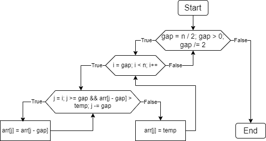
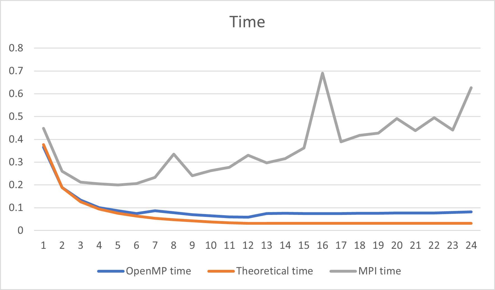
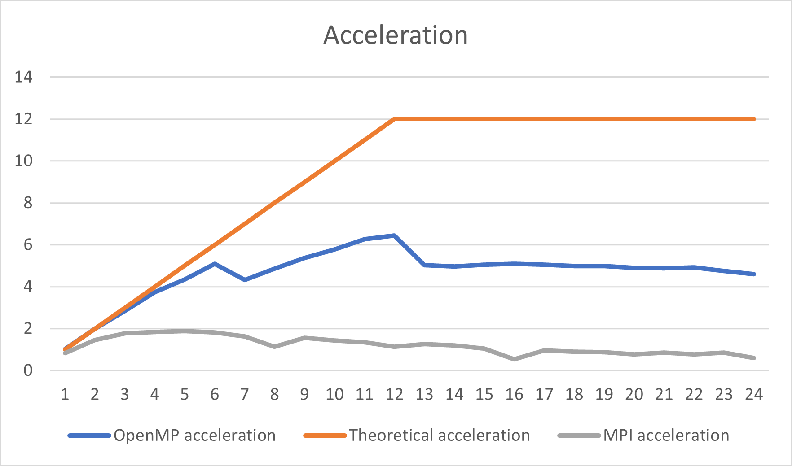
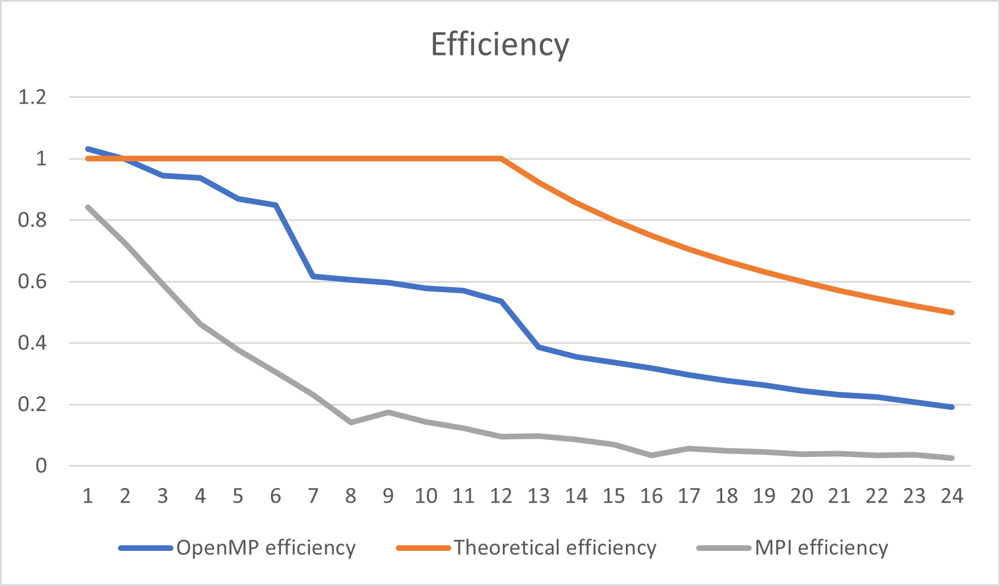

# НИЯУ МИФИ. Лабораторная работа №6. Нестеренко Виталий, Б21-525. 2023

## Используемая система

### Операционная система
Windows 10 LTSC 21H2

### Процессор
Intel Xeon E5-2666v3
```text
Total Cores: 6
Total Threads: 12
Processor Base Frequency: 2.90 GHz
Max Turbo Frequency: 3.50 GHz
L1 cache: 32 KB per core
L2 cache: 256 KB per core
L3 cache: 25 MB
```

### Оперативная память
```text
Memory Type: DDR4
SPD Speed: 2133MHz
Memory Size: 32 GB
```

## Используемый алгоритм

### Принцип работы
Алгоритм разбивает исходный массив array на части, которые сортируются каждым потоком отдельно. Когда заканчивается циклическая часть процесса, значения, полученные в ходе процесса, объединяются в array. В результате получается отсортированный массив.

### Блок схема


### Оценка сложности
**n** - количество чисел в массиве

**t** - количество потоков

- Сложность последовательного алгоритма:
  - В лучшем случае: $O(n\cdot\log{n})$
  - В худшем случае: $O(n^2)$

## Результаты работы
### Вычисления
- Последовательный алгоритм
  ```text
  OpenMP version: 201511
  Avg time: 0.377013
  ```
- Параллельный алгоритм OpenMP
  ```text
  OpenMP version: 201511
  Threads: 1      Avg time: 0.365283
  Threads: 2      Avg time: 0.188833
  Threads: 3      Avg time: 0.132850
  Threads: 4      Avg time: 0.100581
  Threads: 5      Avg time: 0.086783
  Threads: 6      Avg time: 0.074018
  Threads: 7      Avg time: 0.087244
  Threads: 8      Avg time: 0.077673
  Threads: 9      Avg time: 0.070109
  Threads: 10     Avg time: 0.065166
  Threads: 11     Avg time: 0.060023
  Threads: 12     Avg time: 0.058543
  Threads: 13     Avg time: 0.074892
  Threads: 14     Avg time: 0.075776
  Threads: 15     Avg time: 0.074665
  Threads: 16     Avg time: 0.073943
  Threads: 17     Avg time: 0.074608
  Threads: 18     Avg time: 0.075501
  Threads: 19     Avg time: 0.075558
  Threads: 20     Avg time: 0.076793
  Threads: 21     Avg time: 0.077259
  Threads: 22     Avg time: 0.076654
  Threads: 23     Avg time: 0.079189
  Threads: 24     Avg time: 0.081823
  ```

- Параллельный алгоритм MPI
  ```text
  Threads: 1      Avg time: 0.447962
  Threads: 2      Avg time: 0.260328
  Threads: 3      Avg time: 0.212540
  Threads: 4      Avg time: 0.204191
  Threads: 5      Avg time: 0.199653
  Threads: 6      Avg time: 0.206172
  Threads: 7      Avg time: 0.232510
  Threads: 8      Avg time: 0.334440
  Threads: 9      Avg time: 0.240623
  Threads: 10     Avg time: 0.261904
  Threads: 11     Avg time: 0.277616
  Threads: 12     Avg time: 0.330424
  Threads: 13     Avg time: 0.297328
  Threads: 14     Avg time: 0.315045
  Threads: 15     Avg time: 0.362461
  Threads: 16     Avg time: 0.690668
  Threads: 17     Avg time: 0.388800
  Threads: 18     Avg time: 0.417309
  Threads: 19     Avg time: 0.427749
  Threads: 20     Avg time: 0.491246
  Threads: 21     Avg time: 0.438840
  Threads: 22     Avg time: 0.494614
  Threads: 23     Avg time: 0.441049
  Threads: 24     Avg time: 0.625832
  ```

### Графики
#### Зависимость времени работы от количества потоков


#### Зависимость ускорения от количества потоков


#### Зависимость эффективности работы программы от количества потоков


## Заключение

В ходе исследования было установлено, что эффективность MPI на одном компьютере оказывается заметно ниже по сравнению с его работой в кластерных системах. Это связано с тем, что MPI изначально разрабатывался для распределённых вычислительных сред, где взаимодействие между процессами является ключевым. В отличие от OpenMP, предназначенного для многопоточной обработки на одном компьютере, MPI требует более сложной координации процессов, что и приводит к увеличению времени выполнения задач на одном компьютере.

## Приложение
### Последовательная программа
<details>
  <summary>Исходный код последовательной программы</summary>

  ```c
  #include <stdio.h>
  #include <stdlib.h>
  #include <omp.h>

  void shellSort(int* arr, int n) {
      for (int gap = n / 2; gap > 0; gap /= 2) {
          for (int i = gap; i < n; i++) {
              int temp = arr[i];
              int j;
              for (j = i; j >= gap && arr[j - gap] > temp; j -= gap)
                  arr[j] = arr[j - gap];
              arr[j] = temp;
          }
      }
  }

  int main(int argc, char** argv) {
      const int count = 1000000;
      const int random_seed = 132957;
      const int iterations = 20;
      double start_time, end_time, total = 0;
      int* array;

      srand(random_seed);
      printf("OpenMP version: %d\n", _OPENMP);

      for (int j = 0; j < iterations; ++j) {
          array = (int*)malloc(count*sizeof(int));
          for (int i = 0; i < count; ++i) { 
              array[i] = rand();
          }

          start_time = omp_get_wtime();
          shellSort(array, count);
          end_time = omp_get_wtime();
          total += end_time - start_time;

          free(array);
      }

      printf("Avg time: %f\n", total / (double) iterations);
      return 0;
  }
  ```
</details>

### Параллельная программа OpenMP
<details>
  <summary>Исходный код параллельной программы OpenMP</summary>

  ```c
  #include <stdio.h>
  #include <stdlib.h>
  #include <omp.h>

  void shellSort(int* arr, int n, int threads) {
      int i, gap;
      for (gap = n / 2; gap > 0; gap /= 2) {
          #pragma omp parallel for shared(arr, gap, n) private(i) num_threads(threads)
          for (i = gap; i < n; i++) {
              int temp = arr[i];
              int j;
              for (j = i; j >= gap && arr[j - gap] > temp; j -= gap)
                  arr[j] = arr[j - gap];
              arr[j] = temp;
          }
      }
  }

  int main(int argc, char** argv) {
      const int count = 1000000;
      const int random_seed = 132957;
      const int max_threads = 24;
      const int iterations = 20;
      double start_time, end_time, total;
      int* array;

      srand(random_seed);
      printf("OpenMP version: %d\n", _OPENMP);

      for (int threads = 1; threads <= max_threads; threads++) {
          total = 0;

          for (int j = 0; j < iterations; ++j) {
              array = (int*)malloc(count*sizeof(int));
              for (int i = 0; i < count; ++i) { 
                  array[i] = rand();
              }

              start_time = omp_get_wtime();
              shellSort(array, count, threads);
              end_time = omp_get_wtime();
              total += end_time - start_time;

              free(array);
          }
          printf("Threads: %d\tAvg time: %f\n", threads, total / (double) iterations);
      }

      return 0;
  }
  ```

</details>

### Параллельная программа MPI
<details>
  <summary>Исходный код параллельной программы MPI</summary>

  ```c
    #include <stdio.h>
    #include <stdlib.h>
    #include <mpi.h>
    #include <string.h>


    void shellSort(int* arr, int n) {
        int i, gap;
        for (gap = n / 2; gap > 0; gap /= 2) {
            for (i = gap; i < n; i++) {
                int temp = arr[i];
                int j;
                for (j = i; j >= gap && arr[j - gap] > temp; j -= gap)
                    arr[j] = arr[j - gap];
                arr[j] = temp;
            }
        }
    }

    int main(int argc, char** argv) {
        const int count = 1000000;
        const int random_seed = 132957;
        const int max_threads = 24;
        const int iterations = 20;
        double start_time, end_time, total;
        int rank, size;
        int* array;

        srand(random_seed);

        MPI_Init(&argc, &argv);
        MPI_Comm_size(MPI_COMM_WORLD, &size);
        MPI_Comm_rank(MPI_COMM_WORLD, &rank);
        int chunk = count / size;

        for (int j = 0; j < iterations; ++j) {
            int *cur_array, cur_size = count - chunk * (size - 1);
            MPI_Status status;

            if (rank == 0) { // если основной поток, то нужно разослать всем части массива
                array = (int*)malloc(count*sizeof(int));
                for (int i = 0; i < count; ++i) { 
                    array[i] = rand();
                }

                // рассылаем части массива всем потокам
                for (int dest = 1; dest < size; dest++) {
                    MPI_Send(array + chunk * (dest - 1), chunk, MPI_INT, dest, 0, MPI_COMM_WORLD);
                }

                cur_array = malloc(cur_size * sizeof(int));
                int *sorted = malloc(count * sizeof(int));

                // сортируем свою часть массива
                start_time = MPI_Wtime();
                for (int i = chunk * (size - 1), j = 0; i < count; i++, j++) {
                    cur_array[j] = array[i];
                }
                shellSort(cur_array, cur_size);
                memcpy(sorted, cur_array, cur_size * sizeof(int));

                // получаем отсортированные части от других потоков
                for (int src = 1; src < size; src++) {
                    MPI_Recv(sorted + chunk * src, cur_size, MPI_INT, MPI_ANY_SOURCE, 1, MPI_COMM_WORLD, &status);
                }

                // сортируем итоговый массив
                shellSort(sorted, count);
                end_time = MPI_Wtime();

                free(sorted);
                free(cur_array);
            } else { // если поток не основное, то получаем массив, сортируем и отправляем обратно
                cur_array = malloc(chunk * sizeof(int));

                MPI_Recv(cur_array, chunk, MPI_INT, 0, 0, MPI_COMM_WORLD, &status);
                shellSort(cur_array, chunk);
                MPI_Send(cur_array, chunk, MPI_INT, 0, 1, MPI_COMM_WORLD);

                free(cur_array);
            }

            total += end_time - start_time;
        }

        if (rank == 0) {
            printf("Threads: %d\tAvg time: %f\n", size, total / (double) iterations);
        }
        
        MPI_Finalize();

        return 0;
    }
  ```

</details>
