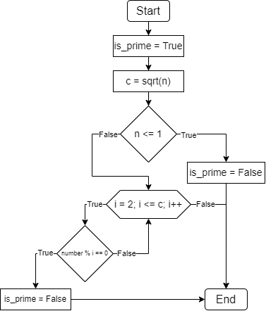
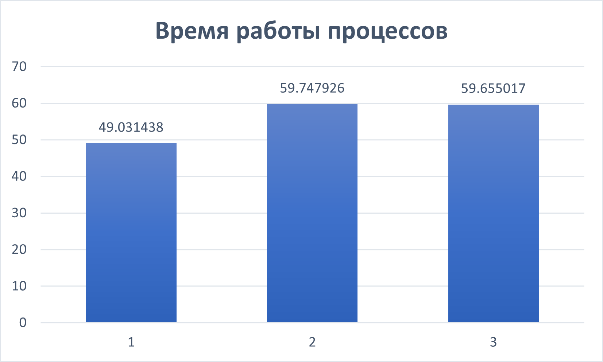

# НИЯУ МИФИ. Лабораторная работа №7. Нестеренко Виталий, Б21-525. 2023

## Используемая система

### Операционная система
Windows 10 LTSC 21H2

### Процессор
Intel Xeon E5-2666v3
```text
Total Cores: 6
Total Threads: 12
Processor Base Frequency: 2.90 GHz
Max Turbo Frequency: 3.50 GHz
L1 cache: 32 KB per core
L2 cache: 256 KB per core
L3 cache: 25 MB
```

### Оперативная память
```text
Memory Type: DDR4
SPD Speed: 2133MHz
Memory Size: 32 GB
```

## Используемый алгоритм

### Принцип работы
Вначале алгоритм проверяет, меньше ли число n двух, поскольку простые числа начинаются с 2. Если n больше или равно 2, то алгоритм проверяет каждое число от 2 до корня из n включительно. Если n делится нацело на текущее число, то оно не является простым, в противном случае n - простое число.

### Блок схема


## Результаты работы
### Входные данные

| Процессы MPI | Потоки OpenMP | Размер рабочей области |
|:------------:|:-------------:|:----------------------:|
|     `3`      |      `2`      |   `0 ... 100000000`    |

### Вычисления
- Последовательный алгоритм
  ```text
  Execution time: 4.647205
  ```
- Параллельный алгоритм OpenMP
  ```text
  Process Time
    0       49.031438
    1       59.747926
    2       59.655017
  ```

### Экспериментальные данные

| Время последовательного алгоритма | Время параллельного алгоритма | Ускорение  | Эффективность |
|:---------------------------------:|:-----------------------------:|:----------:|:-------------:|
|           `121.699077`            |          `59.747926`          | `2.036875` |  `0.339479`   |

#### Распределение вычислительной нагрузки


## Заключение

В результате исследования была написана программа, которая объединяет технологии OpenMPI и OpenMP для выполнения алгоритма поиска простых чисел в заданном диапазоне. ДПрограмма использовала концепцию распределения рабочей нагрузки, используя 3 процесса MPI и 2 потока OpenMP на компьютере с 6 ядрами. После установки такого распределения были проведены измерения времени выполнения для каждого процесса. Оказалось, что эффективность такого метода не очень высока, использовав компьютер с 6 ядрами параллельная программа оказалась быстрее всего лишь в 2 раза. 

## Приложение
### Последовательная программа
<details>
  <summary>Исходный код последовательной программы</summary>

  ```c
    #include <stdio.h>
    #include <stdbool.h>
    #include <math.h>
    #include <omp.h>


    bool isPrime(int number, int *primes) {
        int check_amount = (int) sqrt(number);
        if (number <= 1) return false;

        for (int i = 2; i <= check_amount; i++) {
            if (number % i == 0) {
                return false;
            }
        }

        return true;
    }

    int main(int argc, char **argv) {
        int start = 1;
        int end = 100000000;

        int primes = 0;
        double start_time, end_time;

        start_time = omp_get_wtime();

        for (int n = start; n <= end; n++) {
            primes += isPrime(n, &primes);
        }

        end_time = omp_get_wtime();

        printf("Prime numbers amount between %d and %d: %d\n", start, end, primes);
        printf("Execution time: %f\n", end_time - start_time);

        return 0;
    }
  ```
</details>

### Параллельная программа
<details>
  <summary>Исходный код параллельной программы</summary>

  ```c
    #include <stdio.h>
    #include <stdbool.h>
    #include <stdlib.h>
    #include <math.h>
    #include <omp.h>
    #include <mpi.h>


    bool isPrime(int number, int *primes) {
        bool prime = true;
        int check_amount = (int) sqrt(number);
        if (number <= 1) return false;

        #pragma omp parallel shared(prime, check_amount)
        {
            #pragma omp for
            for (int i = 2; i <= check_amount; i++) {
                if (number % i == 0) {
                    prime = false;
                    i = check_amount + 1;
                }
            }
        }

        if (prime) {
            #pragma omp critical
            {
                *primes += 1;
            }
        }

        return true;
    }

    int main(int argc, char **argv) {
        MPI_Init(&argc, &argv);

        int rank, size;
        MPI_Comm_size(MPI_COMM_WORLD, &size);
        MPI_Comm_rank(MPI_COMM_WORLD, &rank);

        int start = 1;
        int end = 100000000;

        int primes = 0, result = 0;
        double start_time, end_time;

        int chunk = (end - start + 1) / size;
        int rem = (end - start + 1) % size;

        int local_start = start + rank * chunk;
        int local_end = local_start + chunk - 1;

        if (rank < rem) {
            local_start += rank;
            local_end += 1;
        } else {
            local_start += rem;
        }

        int max_threads = omp_get_max_threads();
        int threads = (size > max_threads) ? max_threads / size : 2;
        omp_set_num_threads(threads);
        MPI_Barrier(MPI_COMM_WORLD);

        start_time = MPI_Wtime();
        #pragma omp parallel for
        for (int n = local_start; n <= local_end; n++) {
            isPrime(n, &result);
        }
        end_time = MPI_Wtime();

        MPI_Barrier(MPI_COMM_WORLD);

        double work_time = end_time - start_time;
        double *work_times;
        if (rank == 0) {
            work_times = (double *) malloc(size * sizeof(double));
        }

        MPI_Gather(&work_time, 1, MPI_DOUBLE, work_times, 1, MPI_DOUBLE, 0, MPI_COMM_WORLD);

        if (rank == 0) {
            printf("Process\tTime\n");
            for (int i = 0; i < size; i++) {
                printf("%d\t%f\n", i, work_times[i]);
            }
        }

        MPI_Finalize();

        return 0;
    }
  ```

</details>